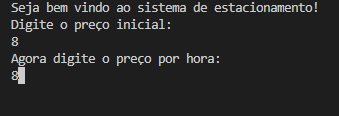
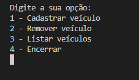
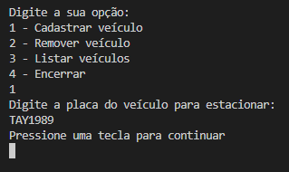
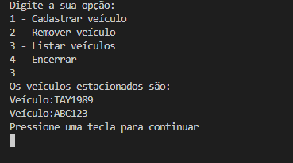
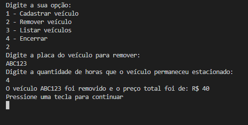

# DIO - Trilha .NET - Fundamentos

www.dio.me

## Desafio de projeto

Para este desafio, você precisará usar seus conhecimentos adquiridos no módulo de fundamentos, da trilha .NET da DIO.

## Contexto

Você foi contratado para construir um sistema para um estacionamento, que será usado para gerenciar os veículos estacionados e realizar suas operações, como por exemplo adicionar um veículo, remover um veículo (e exibir o valor cobrado durante o período) e listar os veículos.

## Proposta

Você precisará construir uma classe chamada "Estacionamento", conforme o diagrama abaixo:


A classe contém três variáveis, sendo:

**precoInicial**: Tipo decimal. É o preço cobrado para deixar seu veículo estacionado.

**precoPorHora**: Tipo decimal. É o preço por hora que o veículo permanecer estacionado.

**veiculos**: É uma lista de string, representando uma coleção de veículos estacionados. Contém apenas a placa do veículo.

A classe contém três métodos, sendo:

**AdicionarVeiculo**: Método responsável por receber uma placa digitada pelo usuário e guardar na variável **veiculos**.

**RemoverVeiculo**: Método responsável por verificar se um determinado veículo está estacionado, e caso positivo, irá pedir a quantidade de horas que ele permaneceu no estacionamento. Após isso, realiza o seguinte cálculo: **precoInicial** \* **precoPorHora**, exibindo para o usuário.

**ListarVeiculos**: Lista todos os veículos presentes atualmente no estacionamento. Caso não haja nenhum, exibir a mensagem "Não há veículos estacionados".

Por último, deverá ser feito um menu interativo com as seguintes ações implementadas:

1. Cadastrar veículo
2. Remover veículo
3. Listar veículos
4. Encerrar

## Solução

### 1. Adicionar Veículo

O sistema solicita ao usuário que digite a placa do veículo e a adiciona à lista de veículos estacionados.

**Código Implementado:**

```
public void AdicionarVeiculo()
{
    Console.WriteLine("Digite a placa do veículo para estacionar:");
    string placa = Console.ReadLine();
    veiculos.Add(placa);
}
```

### 2. Remover Veículo

O sistema verifica se o veículo está na lista e solicita ao usuário a quantidade de horas que ele permaneceu estacionado. Em seguida, calcula o valor total com base na tarifa por hora e remove o veículo da lista.

**Código Implementado:**

```
public void RemoverVeiculo()
{
    Console.WriteLine("Digite a placa do veículo para remover:");
    string placa = Console.ReadLine();

    if (veiculos.Any(x => x.ToUpper() == placa.ToUpper()))
    {
        Console.WriteLine("Digite a quantidade de horas que o veículo permaneceu estacionado:");
        int horas = int.Parse(Console.ReadLine());
        decimal valorTotal = precoInicial + precoPorHora * horas;

        veiculos.Remove(placa);
        Console.WriteLine($"O veículo {placa} foi removido e o preço total foi de: R$ {valorTotal}");
    }
    else
    {
        Console.WriteLine("Desculpe, esse veículo não está estacionado aqui. Confira se digitou a placa corretamente");
    }
}
```

### 3. Listar Veículos

Caso haja veículos estacionados, o sistema lista todos os veículos armazenados na lista.

**Código Implementado:**

```
public void ListarVeiculos()
{
    if (veiculos.Any())
    {
        Console.WriteLine("Os veículos estacionados são:");
        foreach (string v in veiculos)
        {
            Console.WriteLine("Veículo: " + v);
        }
    }
    else
    {
        Console.WriteLine("Não há veículos estacionados.");
    }
}
```

## 📌 Possíveis Melhorias Futuras

Implementar um menu interativo para facilitar a navegação do usuário.

Melhorar a validação de entrada do usuário para evitar erros ao digitar.

Armazenar dados em um banco de dados ou arquivo para persistência.

## 📸 Exemplo de Execução

### Iniciando o Sistema de Estacionamento



### Menu do Sistema de Estacionamento



### Adicionando um veículo:



### Listando Veículos



### Removendo um veículo e calculando o valor:



### Removendo um veículo que não existe:


